# WEB应用系统

## 介绍
&emsp;&emsp;本系统（基于SpringBoot+MyBatis+Apache Shiro+Bootstrap+Thymeleaf） 可用于开发所有企业级WEB应用系统（如:各种后台管理系统、CRM、ERP、CMS、OA、博客、论坛等...）。
响应式布局，支持大部分浏览器（如：IE9+浏览器、Google Chrome、火狐浏览器、360浏览器...)、平板、手机等主流设备

- 感谢[RuoYi](https://github.com/yangzongzhuan/RuoYi-Oracle "若依")提供的框架

## 其它版本
- GitHub（Oracle版本）：[zhglxt-oracle](https://github.com/liuwy-project/zhglxt-oracle "WEB应用系统-Oracle版本")
- GitHub（MySQL版本）：[zhglxt](https://github.com/liuwy-project/zhglxt "WEB应用系统-MySQL版本")
- GitEE（MySQL版本）：[zhglxt](https://gitee.com/liuwy_project/zhglxt "WEB应用系统-MySQL版本")
- GitEE（SpringBoot3+版本）：[zhglxt-springboot3](https://gitee.com/liuwy_project/zhglxt-springboot3 "WEB应用系统-SpringBoot3版本")

## 主要特性
1. 完全响应式布局（支持电脑、平板、手机等所有主流设备）
2. 集成文件管理器（视频、音频、PDF、world、excel等多文件的上传与下载；图片、音频、视频在线预览等）
3. 集成企业官网CMS内容管理系统（简单的企业官网，如需更强大的企业官网可进行二次开发或重新开发）
4. 集成工作流程引擎Activiti5（支持在线设计、部署、查看、编辑流程图）
5. 通知通告（重写了原系统的通知通告模块）
6. 集成MarkDown在线编辑器editor.md
7. WAR包方式进行部署，简单、便捷，无需修改过多的配置
8. 全局事务处理
9. 集成定时任务调度框架，可用于创建简单或复杂的定时计划任务
10. 完善的XSS防范及脚本过滤，彻底杜绝XSS攻击
11. 完善的日志记录体系，简单注解即可实现
12. 数据监控，可查看数据库版本、驱动、数据源、SQL监控、SQL防火墙、WEB应用、URL监控、session监控等信息
13. 服务监控，可查看一些通用的监控，比如 CPU的使用情况、服务器内存使用情况、Java虚拟机信息、服务器的信息、磁盘状态的监控等
14. 缓存监控，可查系统的缓存信息、以及对缓存的清空操作
15. 对常用js插件进行二次封装，使js代码变得简洁，更加易维护
16. 支持按钮级数据权限，可自定义部门数据权限
17. Maven项目依赖管理，方便模块依赖版本升级、增减模块
18. 支持多数据源，简单配置即可实现切换
19. 集成在线表单构建器，拖拽表单元素即可生成相应的HTML代码、表单代码
20. 集成swagger（swagger + knife4j）系统接口、UI框架
21. 丰富的演示示例，帮助开发者快速集成到项目中

## 技术选型
1. 系统环境【JDK 1.8、Oracle19c、Tomcat 9】
2. 主框架【Spring Boot】
3. 持久层【Apache MyBatis】
4. 视图层【Bootstrap】
5. 安全框架【Apache Shiro】
6. 缓存框架【shiro-ehcache】
7. 任务调度框架【Quartz】
8. 业务流程管理（BPM）框架【Activiti】
9. 文件管理器【CKFinder】
10. 服务端验证【Hibernate Validation】
11. 客户端验证【jQuery Validation】
12. 树型插件 【jQuery zTree】
13. 项目版本控制【Git】
14. 项目管理工具【Apache Maven】
15. 富文本编辑器【summernote】
16. MarkDown在线编辑器【editor.md】

## 内置功能
1.  用户管理：用户是系统操作者，该功能主要完成系统用户配置
2.  部门管理：配置系统组织机构（国家、城市、公司、部门），树结构展现支持数据权限
3.  岗位管理：配置系统用户所属担任职务
4.  菜单管理：配置系统菜单，操作权限，按钮权限标识等
5.  角色管理：角色菜单权限分配、设置角色按机构进行数据范围权限划分
6.  字典管理：对系统中经常使用的一些较为固定的数据进行维护
7.  参数管理：对系统动态配置常用参数
8.  通知公告：系统通知公告信息发布维护
9.  操作日志：系统正常操作日志记录和查询；系统异常信息日志记录和查询
10. 登录日志：系统登录日志记录查询包含登录异常
11. 在线用户：当前系统中活跃用户状态监控
12. 定时任务：在线（添加、修改、删除)任务调度包含执行结果日志
13. 代码生成：前后端代码的生成（java、html、xml、sql）支持CRUD下载
14. 系统接口：根据业务代码自动生成相关的api接口文档
15. 服务监控：监视当前系统CPU、内存、磁盘、堆栈等相关信息
16. 在线构建器：拖动表单元素生成相应的HTML代码
17. 连接池监视：监视当前系统数据库连接池状态，可进行分析SQL找出系统性能瓶颈
18. CMS企业官网：【栏目管理（栏目列表）、内容管理（广告列表、文章列表）、文档管理（文档列表）】；支持多站点建站，各个站点之间数据互不影响，可随意切换站点
19. 文件管理：每个用户拥有属于自己的文件管理器；支持多种格式文件（图片、视频、音频、Excel、Word、CSV等格式）的上传与下载、图片-视频-音频在线预览（播放）等功能
20. 在线办公：通知公告【我的通知、通告管理】、个人办公【我的任务、请假申请】
21. 工作流程管理：模型【模型管理】、流程【流程列表、运行中的流程、流程管理】
22. DEMO管理：EasyExcel导入导出Demo、MarkDown在线编辑器

## 演示地址
1. 演示地址：[zhglxt](http://8.134.117.219:8080/zhglxt "WEB应用系统") 用户名/密码：system / system
2. 演示地址（企业官网）：[zhglxt-cms](http://8.134.117.219:8080/zhglxt/cms/index.html "企业官网")

## 客户端说明
1.  支持大部分主流浏览器（如：IE9+浏览器、Google Chrome、火狐浏览器、360浏览器等等。。。)
2.  支持手机、平板等主流设备

## 使用说明
1. 安装好系统所需的运行、开发环境（JDK1.8+、Oracle19c、maven3.6+、Git环境等...）
2. 复制项目Git地址
   

3. 打开IntelliJ IDEA，把上面的Git地址粘贴到URL中，Clone项目代码到本地
   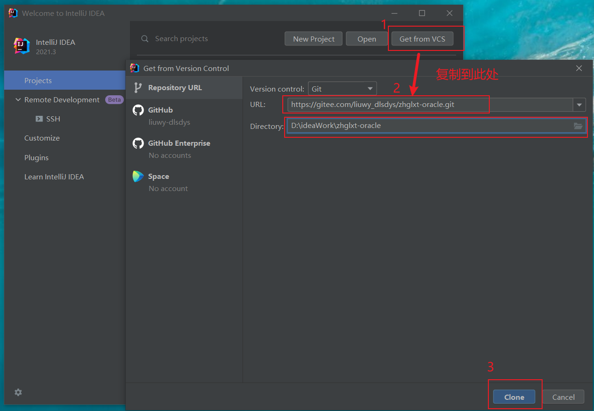
   或者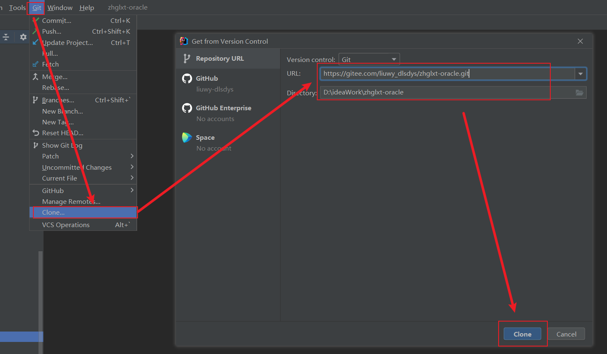

4. 拉取完毕后，Maven就会自动下载项目所有依赖包到本地仓库。目录结构如下
   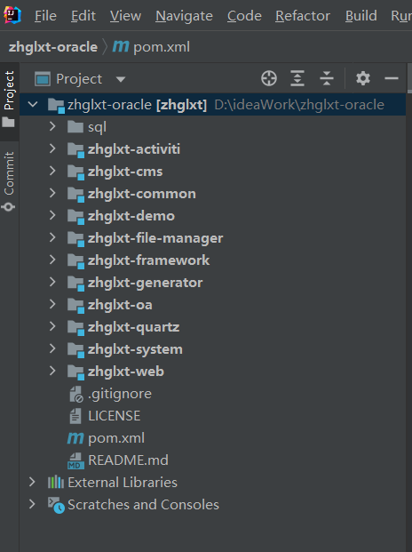

5. 第一次启动，需要install安装到本地仓库
   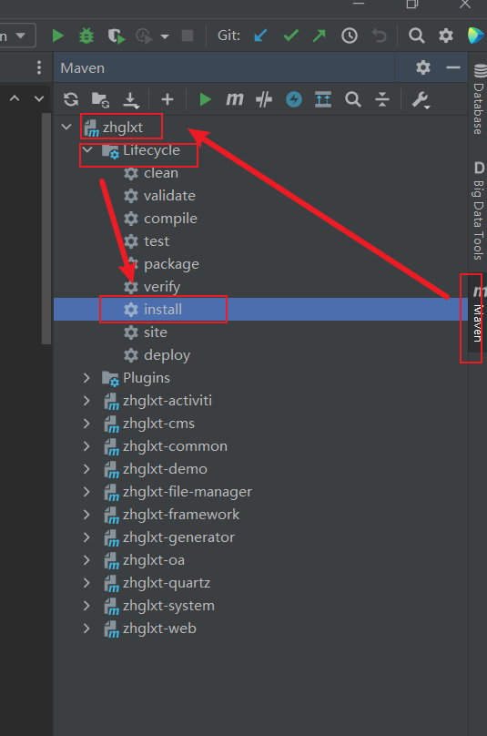

6. 导入数据文件的数据到本地Oracle数据库（新建一个表空间【ZHGLXT】和用户【zhglxt】）
   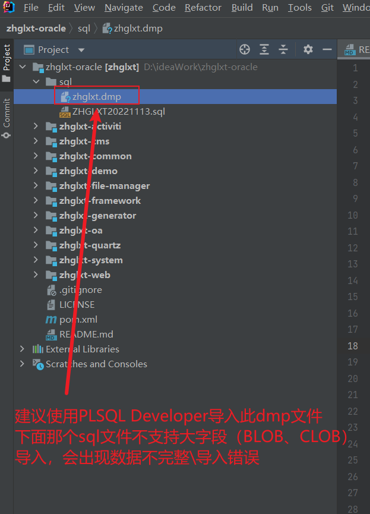

7. 修改Oracle数据库的连接信息
   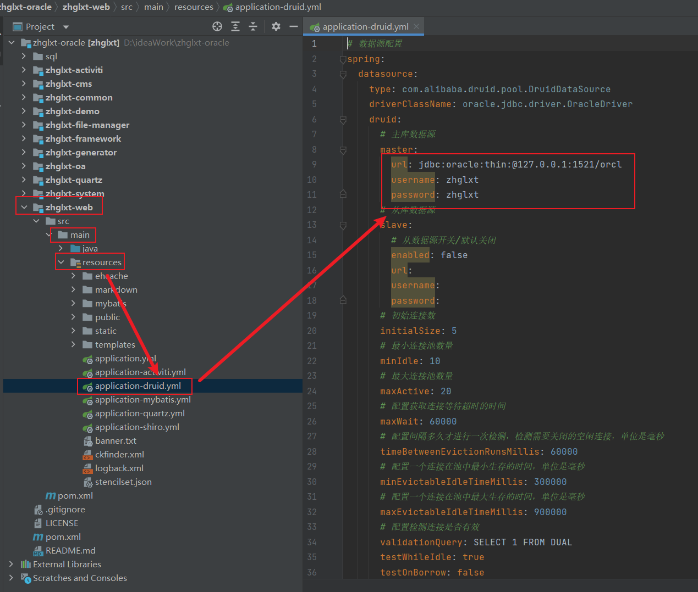

8. 所有步骤没问题之后，就可以直接运行项目了，启动文件
   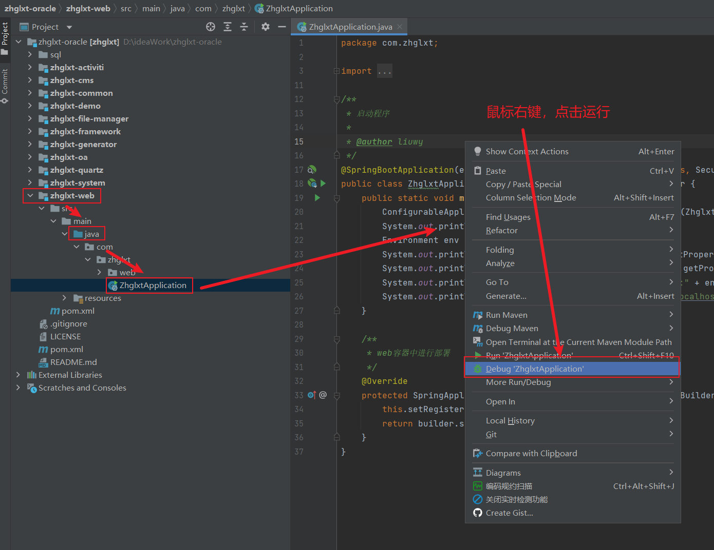
   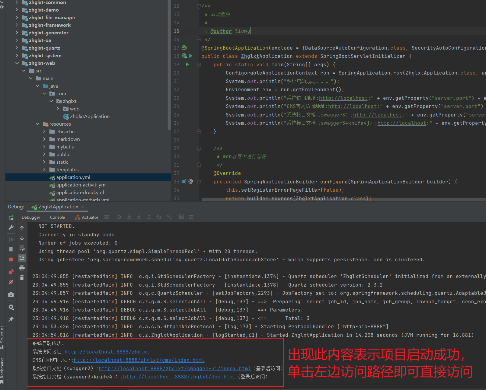

9. 登录账号密码：system/system【提示：系统中的所有用户的密码与该登录名一致。如 test1密码为test1；test2密码为test2】

10. 打包部署（本项目是打成war包的方式进行部署的）
    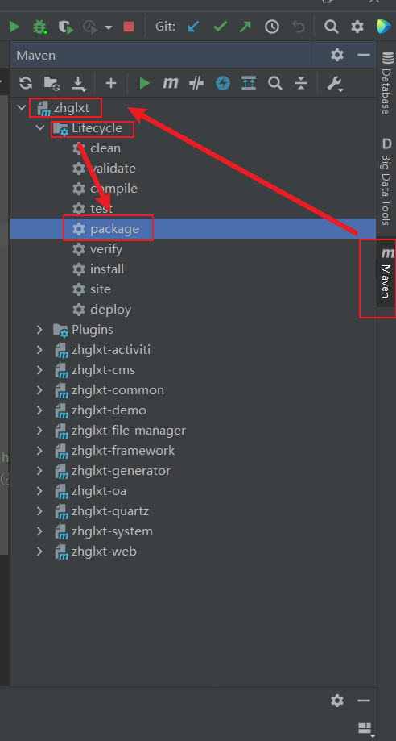

11. 打包完成后，到项目的目录下找到zhglxt\zhglxt-web\target\zhglxt-web.war包，重命名为zhglxt.war，然后直接放到Tomcat的webapps目录下，就可以运行起来了
    

## 系统截图
1. 后台登录页面
   

2. 后台首页
   

3. CMS首页
   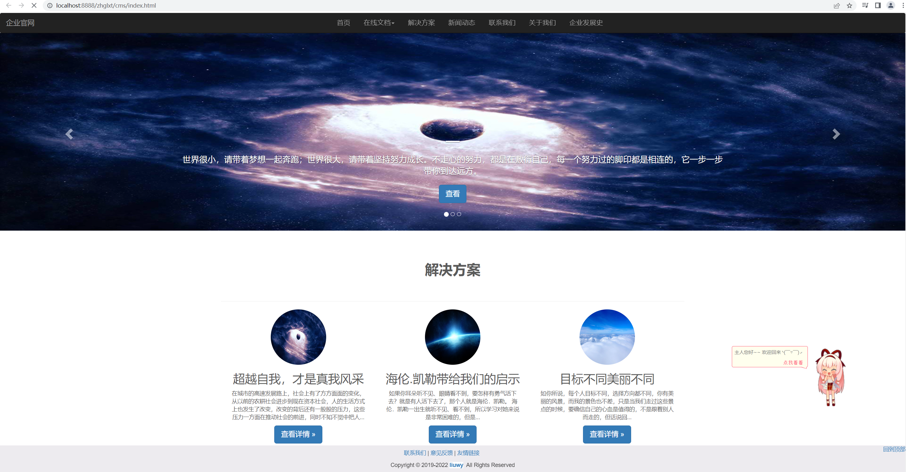
   如需CMS官网资源文件（图片、音频），下载地址：https://pan.baidu.com/s/15rrKWJNhSSP8pxnU7RNklQ?pwd=asdf  提取码：asdf 解压后整个文件夹复制到系统D盘即可

4. 工作流
   
   

5. 文件管理器
   

6. 通知通告
   
   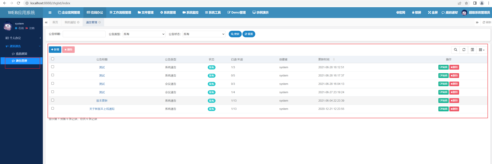
   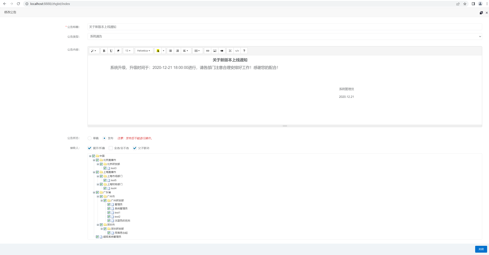